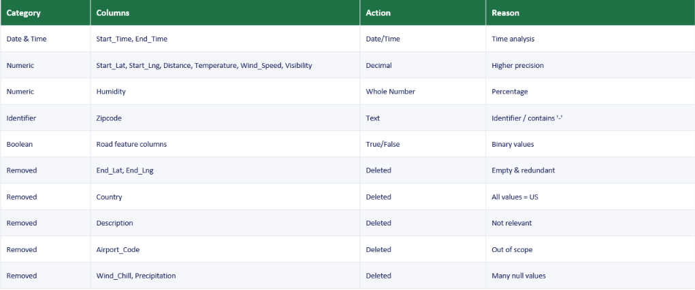
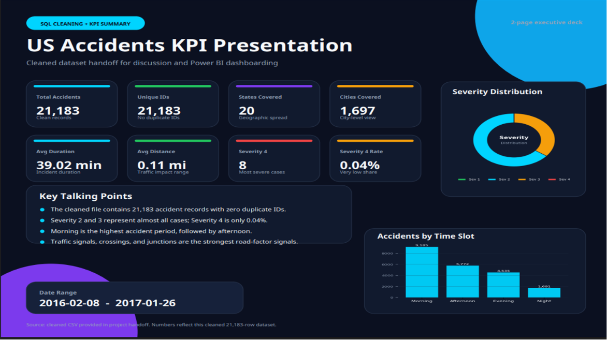
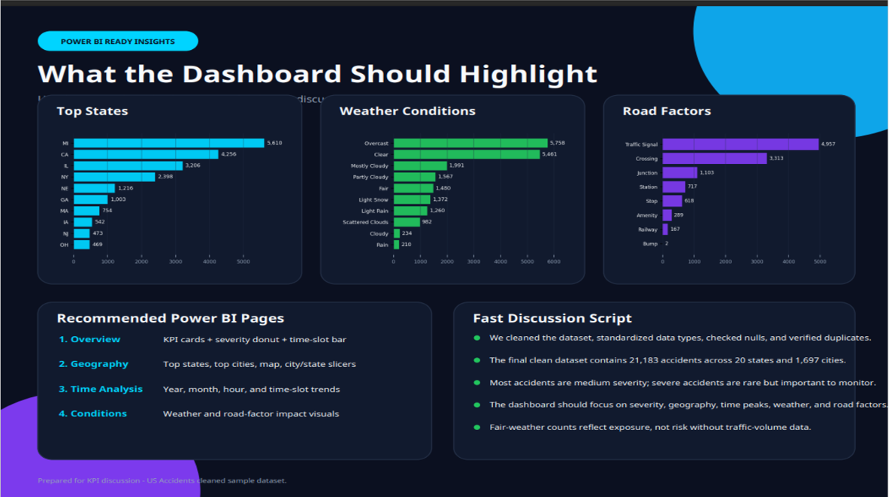
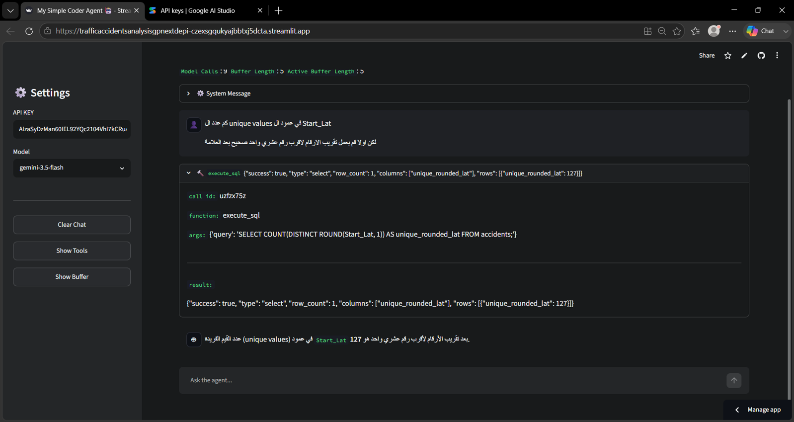
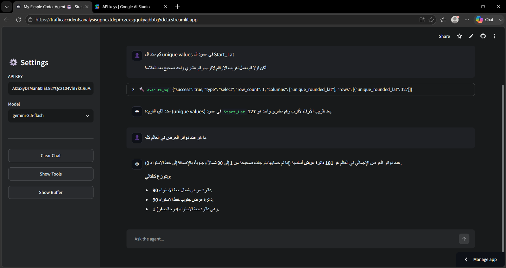
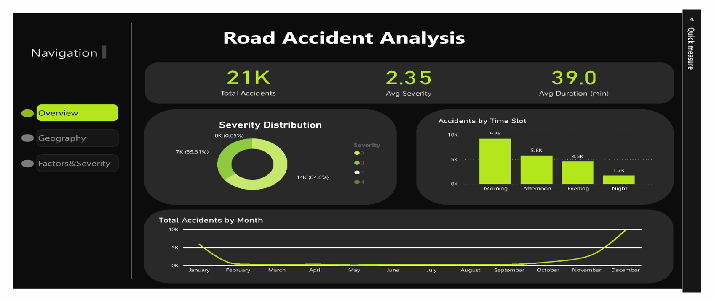
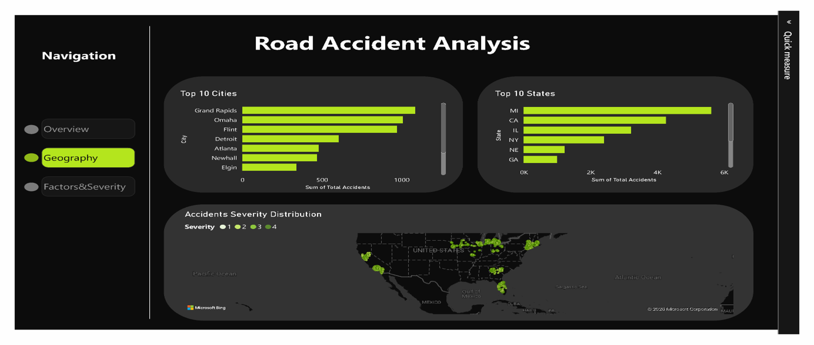
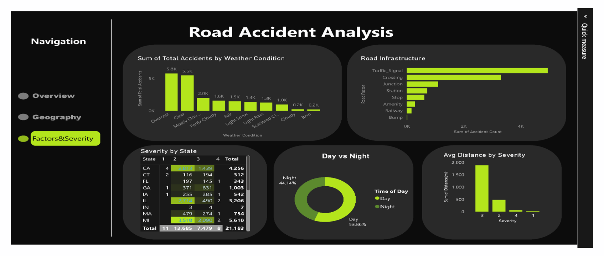

# US Road Safety Analytics: Analysis of Road Traffic Accidents in USA

## Project Overview

This project focuses on a comprehensive analysis of road traffic accidents in the USA, utilizing a multi-tool approach
to transform raw accident records into actionable safety decisions. The analysis covers a slice of the US Accidents
dataset (Kaggle) from January 2016 to January 2017, encompassing 21,183 accident records across 11 states.

## Business Objective

The primary objective is to identify patterns and insights from accident data to support road-safety planning. This
involves answering key questions such as:

- Which states and cities experience the highest accident volumes?

- When do accidents peak – by time slot and day/night?

- Which road and weather factors are most frequently associated with accidents?

- How severe are these accidents, and how are severity levels distributed?

## The Analytical Pipeline

The project employs a four-stage pipeline, leveraging different tools for specific analytical tasks:

1. **Excel**: Data Cleaning & Standardization

1. **SQL Server**: Server-Side Analysis & Analytical Table Building

1. **Python (AI Agent)**: Natural-Language Querying over Data

1. **Power BI**: Interactive Dashboard & Findings Visualization

### 1. Excel — Data Cleaning

**Objective**: Standardizing the raw dataset before analysis to improve data quality, consistency, and analytical
accuracy.

**Actions Performed**:

- **Date & Time Columns (Start_Time, End_Time)**: Standardized to Date/Time format for time analysis.

- **Numeric Columns (Start_Lat, Start_Lng, Distance, Temperature, Wind_Speed, Visibility)**: Converted to Decimal for
  higher precision.

- **Numeric Column (Humidity)**: Converted to Whole Number for percentage representation.

- **Identifier Column (Zipcode)**: Maintained as Text due to containing non-numeric characters.

- **Boolean Columns (Road feature columns)**: Converted to True/False for binary values.

- **Removed Columns**: End_Lat, End_Lng (empty & redundant), Country (all values = US), Description (not relevant),
  Airport_Code (out of scope), Wind_Chill, Precipitation (many null values).

**Outcomes**:

- Corrected inconsistent data types.

- Removed redundant and irrelevant columns.

- Handled null values by removing low-quality columns.

- Eliminated empty and redundant fields.

- Improved data consistency and reduced dataset size.

- Prepared the dataset for reliable analysis and interactive dashboard development.

### 2. SQL Server — Analytical Workflow

**Objective**: Building the analytical table with T-SQL for server-side analysis.

*(Further details on specific SQL queries and table structures can be added here if available.)*

### 3. Python — AI Query Agent

**Concept**: Transitioning from traditional language models to AI agents that can perceive, decide, and act to achieve
goals by using tools.

- **Large Language Model (LLM)**: An AI model trained on vast text data, understanding and generating human language.

- **AI Agent**: An AI system that thinks, plans, and uses tools to interact with the outside world.

- **Tools**: Crucial for extending an agent's capabilities beyond language processing, allowing access to external
  data (APIs), code execution, and database querying.

**Our Agent: Traffic Accident AI Assistant**

A specialized AI agent designed for analyzing US traffic accident data. It processes user questions in natural language,
generates SQL queries, executes them against the database, and interprets the results into clear answers.

**Agent Workflow**:

1. **Understand User Intent**: Determine if database access is needed.

1. **Generate SQL Query**: Create a valid SELECT statement.

1. **Execute Query**: Run it through a read-only `execute_sql` tool.

1. **Interpret Results**: Read and interpret the returned rows.

1. **Formulate Answer**: Produce a clear, concise final answer.

1. **Error Handling**: Explain SQL errors and retry if possible.

The agent runs on a lightweight, embedded SQLite database containing a single `accidents` table.

**Why an AI Agent?**

- **Easy Data Access**: Natural language queries for non-SQL users.

- **Fast Analysis**: Quick processing of complex questions and responses.

- **Accurate Information**: A dedicated SQL tool ensures data integrity.

- **Improved Decision-Making**: Provides insights for road safety.

- **Scalability**: Adaptable to other databases and analytical domains.

- **Test the agent**: [Click](https://trafficaccidentsanalysisgpnextdepi-czexsgqukyajbbtxj5dcta.streamlit.app/)

### 4. Power BI — Dashboard & Findings

**Objective**: Creating interactive dashboards to visualize key performance indicators (KPIs) and uncover patterns
related to severity, geography, and time.

**Key Performance Indicators (KPIs)**:

- **Total Accidents**: 21,183

- **Average Severity**: 2.35

- **Average Duration**: 39.0 minutes

- **Day Share**: 55.86%

- **Night Share**: 44.14%

- **States Represented**: 11

**Severity Analysis**:

- Severity 2 dominates the sample (64.61%), followed by Severity 3 (35.31%).

- Severities 1 and 4 are rare, making up only 0.09% combined.

**Geographic Distribution**:

- **Top States**: Michigan (MI), California (CA), and Illinois (IL) lead in accident volume.

- **Top Cities**: Grand Rapids (MI), Flint (MI), and Detroit (MI) are prominent, indicating Michigan's overall high
  accident rate.

**Time Patterns**:

- **Morning** is the highest-risk time slot, accounting for 43% of accidents.

- Daytime accidents (55.86%) are more frequent than nighttime accidents (44.14%).

## Team Members

- **Ziad Ghllab**: [LinkedIn](https://www.linkedin.com/in/ziad-ghllab-850285407)

- **Retaj Tariq**: [LinkedIn](https://www.linkedin.com/in/retaj-tariq-9501a6389)

- **Abdelrahman Hashish**:[LinkedIn](https://www.linkedin.com/in/abdelrahman-hashish-a95529378)

- **Malak Magdi**: [LinkedIn](https://www.linkedin.com/in/malak-magdi-64a1aa377)

- **Salma Ahmed**: [LinkedIn](https://www.linkedin.com/in/salma-ahmed-582b63316)

- **Eslam Ahmed**: [LinkedIn](https://www.linkedin.com/in/eslam-ahmed-5734ba2b5)

- **Yosef Samy**: [LinkedIn](https://www.linkedin.com/in/yosef0samy)

